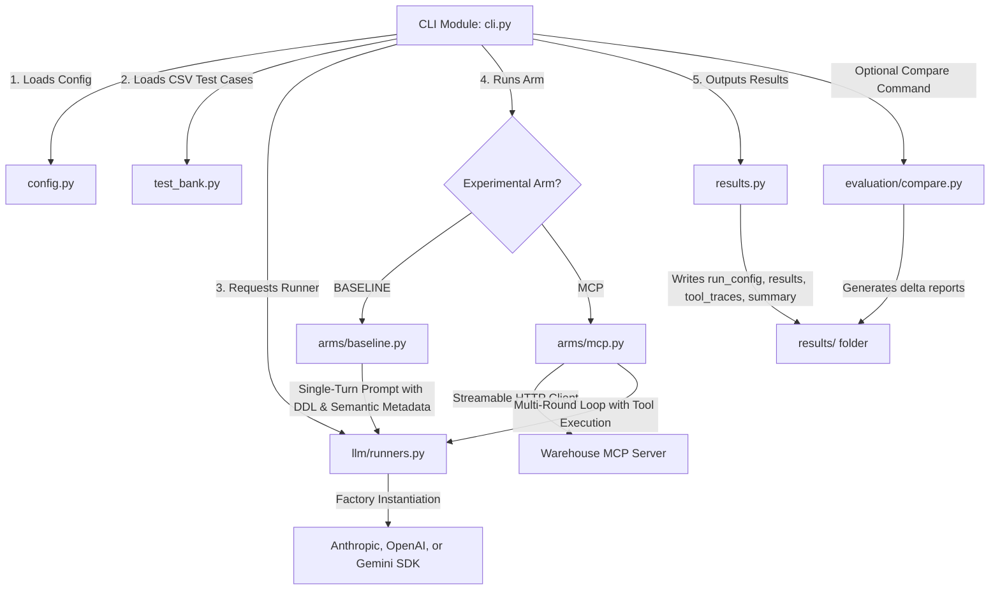

# Architecture & System Documentation

This document describes the application overview and the technical architecture of the **ai-chat-client** benchmarking harness.

---

## 1. Application Overview

The **ai-chat-client** is a Python-based CLI benchmark harness designed to evaluate and compare two distinct methodologies for solving database querying questions (Text-to-SQL) using Large Language Models (LLMs):

1. **`BASELINE` Arm**: The LLM is provided with static schema context (either read from a schema file or provided via environment variables) and optional semantic layer metadata (glossaries, schemas, etc.). It is then asked to output a raw SQL query directly in one turn.
2. **`MCP` Arm**: The LLM acts as an agent equipped with access to a database through a remote **Model Context Protocol (MCP)** server (such as a Warehouse MCP server). It interactively discovers tables, queries table statistics, reads semantic glossaries, and runs queries through multiple rounds to construct and verify the final answer.

The harness automates running a test bank of questions against these two arms, logs detailed metrics (latency, input/output/cached tokens, success rates, and tool traces), and compares the runs side-by-side to assess the benefits and trade-offs of the agentic MCP approach versus direct prompting.

---

## 2. Technical Architecture

The architecture is built as a modular CLI client that abstracts both the **experimental strategy (Arms)** and the **LLM provider** to allow multi-model and multi-provider benchmarking.

---

## 3. Directory & File Tour

Here is a breakdown of the key files and folders in the codebase:

### Root Level
*   **[main.py](file:///Users/manoharrana/Documents/GitHub/ai-chat-client/main.py) / [run_harness.py](file:///Users/manoharrana/Documents/GitHub/ai-chat-client/run_harness.py)**: Lightweight entry points that invoke the CLI's main entry point.
*   **[pyproject.toml](file:///Users/manoharrana/Documents/GitHub/ai-chat-client/pyproject.toml)**: Defines the Python dependencies (including `anthropic`, `google-genai`, `mcp`, `openai`, and `pandas`) and registers the `ai-chat-client` script.
*   **[schema.sql](file:///Users/manoharrana/Documents/GitHub/ai-chat-client/schema.sql)**: An optional database schema SQL file used as database context in the `BASELINE` arm.
*   **[semantic/](file:///Users/manoharrana/Documents/GitHub/ai-chat-client/semantic)**: Contains semantic layer metadata files (`glossary.yml`, `main.yml`, `schemas.yml`) containing business glossaries and descriptions to assist the LLM in understanding data columns.

---

### Core package: `ai_chat_client/`

*   **[config.py](file:///Users/manoharrana/Documents/GitHub/ai-chat-client/ai_chat_client/config.py)**: Exposes a `Settings` dataclass that parses configurations from the environment (`.env`). It handles credentials, LLM model choice, temperature, database dialects, results directories, and active experimental modes.
*   **[cli.py](file:///Users/manoharrana/Documents/GitHub/ai-chat-client/ai_chat_client/cli.py)**: Orchestrates CLI commands:
    *   `run`: Executes a test run for the configured arm.
    *   `doctor`: Validates the streamable HTTP transport connection to the target MCP server and lists available tools.
    *   `compare`: Runs a Pandas-driven diff between baseline and MCP results.
*   **[test_bank.py](file:///Users/manoharrana/Documents/GitHub/ai-chat-client/ai_chat_client/test_bank.py)**: Parses questions, complexity tiers, expected SQL, and notes from test CSVs (e.g., `test_bank.csv`).
*   **[results.py](file:///Users/manoharrana/Documents/GitHub/ai-chat-client/ai_chat_client/results.py)**: Defines the `ExperimentResult` data structures and handles serialization to CSV, JSON, JSONL, and summaries.

---

### Arms Package: `ai_chat_client/arms/`

This package handles the orchestration logic specific to the benchmark arm:
*   **[baseline.py](file:///Users/manoharrana/Documents/GitHub/ai-chat-client/ai_chat_client/arms/baseline.py)**: Constructs system payloads containing DDL schemas, semantic metadata context (when `SEMANTIC_DEFAULT=on` is configured), and the user's question. It runs a single model invocation, extracts the code-fenced SQL, and validates that it is a read-only query.
*   **[mcp.py](file:///Users/manoharrana/Documents/GitHub/ai-chat-client/ai_chat_client/arms/mcp.py)**: Opens an HTTP streamable client connection to the MCP Server, retrieves declared tools, and translates them to the LLM. It manages the agentic event loop (up to `MAX_TOOL_ROUNDS`), intercepting and executing the model's tool calls against the server and returning findings to the model context.

---

### LLM Interface: `ai_chat_client/llm/`

*   **[runners.py](file:///Users/manoharrana/Documents/GitHub/ai-chat-client/ai_chat_client/llm/runners.py)**: Contains the `BaseRunner` abstraction and standardizes response outputs into a unified model response payload (`UniversalResponse`) and token usage data (`UniversalUsage`). Includes concrete implementations:
    *   `AnthropicRunner`: Uses the `anthropic` SDK.
    *   `OpenAIRunner`: Uses the `openai` SDK.
    *   `GeminiRunner`: Uses the new `google-genai` SDK.
*   **[anthropic_client.py](file:///Users/manoharrana/Documents/GitHub/ai-chat-client/ai_chat_client/llm/anthropic_client.py)**: Contains secondary Anthropic helpers.

---

### Evaluation: `ai_chat_client/evaluation/`

*   **[compare.py](file:///Users/manoharrana/Documents/GitHub/ai-chat-client/ai_chat_client/evaluation/compare.py)**: Merges the baseline and MCP result logs on `question_id` via Pandas, generating statistical deltas for latency (milliseconds total), token overhead/savings, average tool calls, and success rate comparisons. It outputs the reports in CSV and JSON formats.
